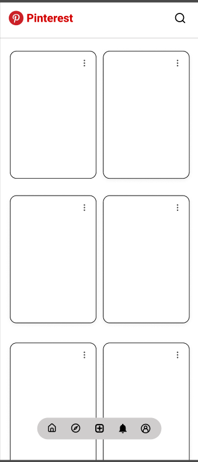
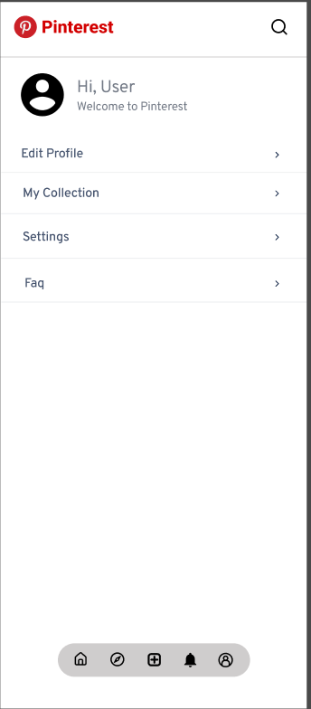
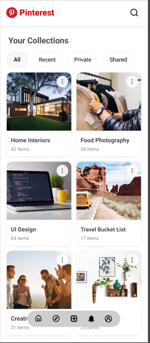

# Pinterest UI Enhancement – Save to Folder Feature

This project focuses on enhancing the Pinterest mobile app by adding a **"Save to Folder"** feature. The goal is to improve user experience by allowing users to organize saved posts into custom folders for better content management.

## 🔧 Tools Used
- Figma (Design & Prototyping)

## 🚀 Key Features
- Organize saved pins into custom folders
- Clean and user-friendly interface
- Improved navigation and content accessibility

## 📸 Screenshots

### 1. Home Feed UI

### 2. Settings Page

### 3. Folder Organization View

## 📁 Figma Prototype
Check out the interactive prototype: [Figma Design Link](https://www.figma.com/design/qVPkzIMJ44AtUFNmuHGKsw/Pinterest-Menu?node-id=0-1&p=f&t=KBdBwdmv1YVagZ5A-0)

---

> Designed with ❤️ using Figma
